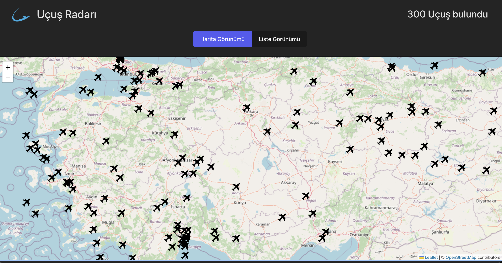
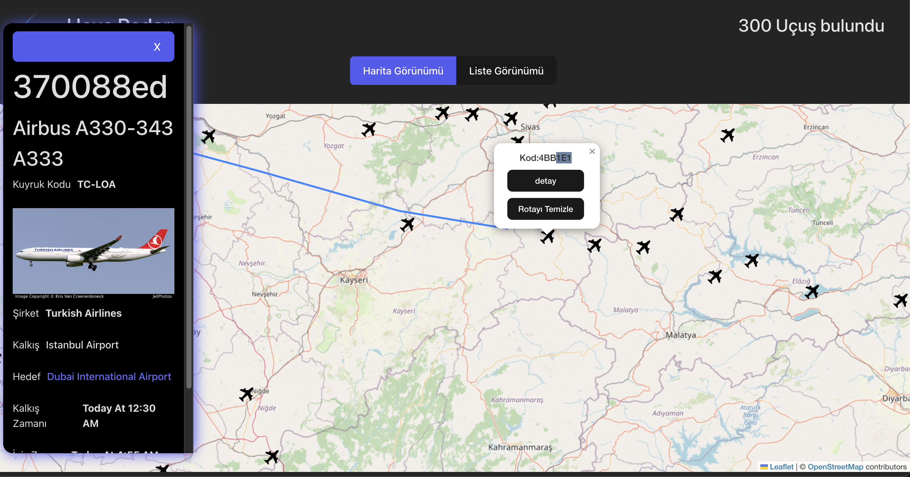
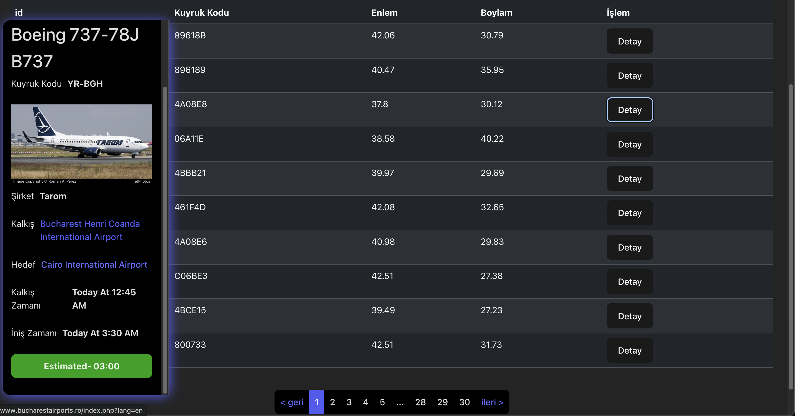

### Toolkit-Thunk-Flight-Radar


A flight radar application that allows users to track airplanes in real-time on a map and access detailed information about selected flights. Built using React and Vite, the application leverages Redux Toolkit for efficient state management and toolkit-thunk for handling asynchronous API requests.

<h2> Video gif</h2>


<h2>Map Page</h2>



<h2>Map Page Detail</h2>



<h2>List Page Detay</h2>




## Table of Contents


- Introduction
- Features
- Technologies
- Installation
- Usage
- Contributing
- Contact


## Introduction

Toolkit-thunk-flight-radar provides real-time tracking of flights on an interactive map. Users can:

- Track the selected airplane's route on the map.
- Access detailed flight information such as:
   - Departure and arrival airports
   - Aircraft type
   - Aircraft code
   - Airline
   - Departure and arrival times.
   - View a list of flights within a specific location, based on API-defined boundaries, through a user-friendly list page.
   - The list page includes all flights, and with React Paginate, users can easily navigate through the flights in a paginated, user-friendly interface.
   - Fetch various data from the API, which can be customized to display additional information as needed.

This application offers a user-friendly interface, combining real-time flight tracking with an intuitive list of flights and map-based tracking.


## Features

- Real-Time Flight Tracking: Track airplanes in real-time on an interactive map.
- Flight Information: View detailed information about selected flights, including airline, speed, altitude, and flight number.
- React Select: Enhanced language selection with a searchable dropdown.
- State Management: Utilizes Redux Toolkit for streamlined state handling.

- Asynchronous Operations: Fetch live flight data using toolkit-thunk.
- API Integration: Send requests to the translation API via RapidAPI.
- User-Friendly Interface: Designed for ease of use, allowing quick interaction with the flight data.

## Technologies 
The main technologies and libraries used in this project are:


- React
- Vite
- React Redux
- React Toolkit
- toolkit-thunk for handling async operations
- React-select
- Axios for making HTTP requests
- Bootstrap CSS for styling
- Leaflet for interactive maps
- RapidAPI for translation API integration
- Moment for date handling
- React Paginate for pagination


 ##  Installation 

- Clone the project to your local machine:
git clone https://github.com/ozerbaykal/toolkit-thunk-flight-radar.git

- Navigate to the project directory:
```
cd toolkit-thunk-flight-radar
```
- Install the necessary packages:
```
npm install
```
### or
 ```
 yarn install
```

## Usage

- Start the development server:
```
npm run dev
```
### or
```
yarn dev
```

<h2>Contributing</h2>

Contributions are welcome! Please open an issue first to discuss what you would like to change.

- 1.Fork the project 
- 2.Create your feature branch (git checkout -b feature/NewFeature)
- 3.Commit your changes (git commit -m 'Add new feature')
- 4.Push to the branch (git push origin feature/NewFeature)
- 5.Open a Pull Request


<h2>Contact</h2>


Özer BAYKAL  mail : baykalozer87@gmail.com

Project Link: https://github.com/ozerbaykal/toolkit-thunk-flight-radar